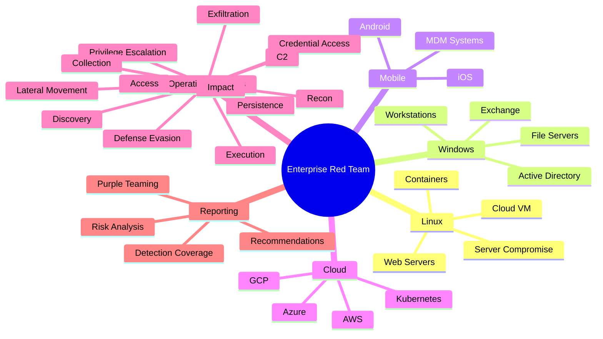
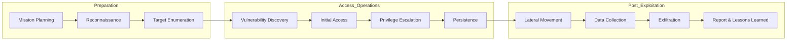

```mermaid
mindmap
  root((Enterprise Red Team))

    Linux
      Server Compromise
      Web Servers
      Containers
      Cloud VM

    Windows
      Workstations
      Active Directory
      Exchange
      File Servers

    Mobile
      Android
      iOS
      MDM Systems

    Cloud
      Azure
      AWS
      GCP
      Kubernetes

    Operational Phases
      Recon
      Access
      Execution
      Persistence
      Privilege Escalation
      Defense Evasion
      Credential Access
      Discovery
      Lateral Movement
      Collection
      C2
      Exfiltration
      Impact

    Reporting
      Risk Analysis
      Detection Coverage
      Purple Teaming
      Recommendations
```

# RED Team Steps

```mermaid
flowchart LR

subgraph Preparation
    A[Mission Planning]
    B[Reconnaissance]
    C[Target Enumeration]
    A --> B --> C
end

subgraph Access_Operations
    D[Vulnerability Discovery]
    E[Initial Access]
    F[Privilege Escalation]
    G[Persistence]
    D --> E --> F --> G
end

subgraph Post_Exploitation
    H[Lateral Movement]
    I[Data Collection]
    J[Exfiltration]
    K[Report & Lessons Learned]
    H --> I --> J --> K
end

C --> D
G --> H
```

## Reconnaissance
> You can access the **Reconnaissance** Techniques page through this [link](./Reconnaissance.md).
