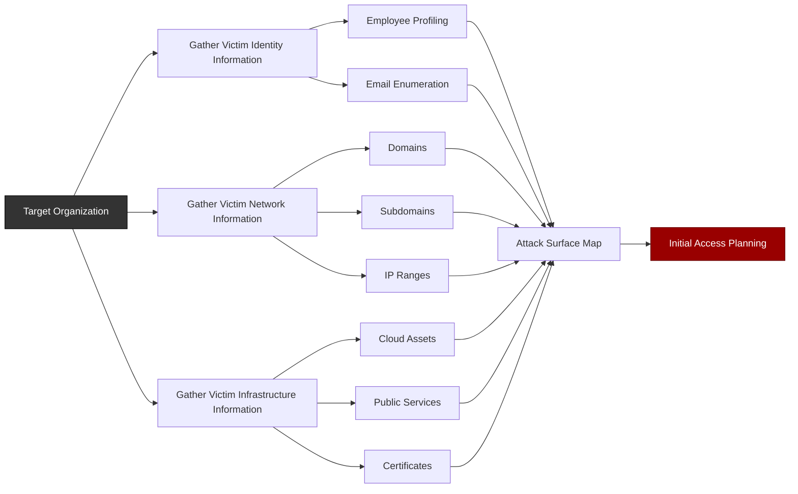

# Reconnaissance



## [NMAP](https://www.kali.org/tools/nmap/)

```bash
nmap -sS -sV -T4 -p 1-1000 <remote-ip>
```

## [FEROXBUSTER](https://www.kali.org/tools/feroxbuster/)
```bash
feroxbuster -u http://<remote-ip>/blog/
```

```bash
feroxbuster -u http://<remote-ip>/blog/ -x php
```

```bash
feroxbuster -u http://<remote-ip>/blog/ -s 200 -s 301 -x php -q
```

## [SAMBA](https://www.kali.org/tools/samba)

### [smbclient](https://www.kali.org/tools/samba/#smbclient)

```bash
smbclient -L <remote-ip>
```
### [rpcclient](https://www.kali.org/tools/samba/#rpcclient)

```bash
rpcclient -U "" <remote-ip> -N
```

```bash
rpcclient $> enumdomusers
```

## [LDAPSEARCH](https://man7.org/linux/man-pages/man1/ldapsearch.1.html)

```bash
ldapsearch -x -H ldap://<remote-ip> -b "dc=<DOMAINNAME>, dc=local" "(objectClass=user)" | grep "sAMAccountName" | awk '{print$2}'
```

## [IMPACKET SCRIPTS](https://www.kali.org/tools/impacket-scripts/)

```bash
impacket-GetNPUsers -request <DOMAINNAME>/ -no-pass -dc-ip <remote-ip> -usersfile users.txt
```

## [EXPLOITDB](https://www.kali.org/tools/exploitdb/)

```bash
searchsploit nibbleblog
```

## [METASPLOIT](https://www.kali.org/tools/metasploit-framework/)

```bash
msfconsole -q
```

```bash
msf6> search nibble
```

## [REVERSE SHELL](https://www.imperva.com/learn/application-security/reverse-shell/)

Method: `Python pty module`
  ```bash
  python -c 'import pty; pty.spawn("/bin/bash")'
  ```
## [BURP SUITE](https://www.kali.org/tools/burpsuite/)

```bash
burpsuite &
```

## TOOLSET
* [GTFOBins](https://gtfobins.org/) - GTFOBins is a curated list of Unix-like executables that can be used to bypass local security restrictions in misconfigured systems.

