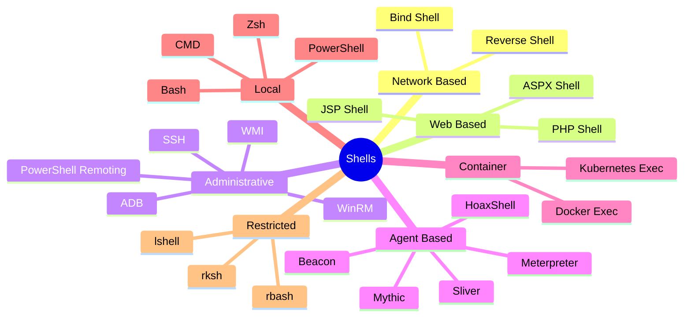
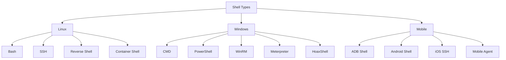
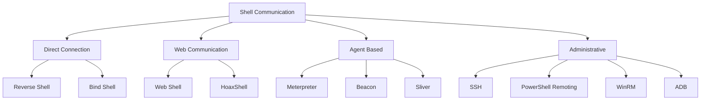
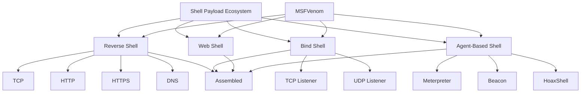

```mermaid
mindmap
  root((Shells))

    Network Based
      Reverse Shell
      Bind Shell

    Web Based
      PHP Shell
      ASPX Shell
      JSP Shell

    Administrative
      SSH
      WinRM
      WMI
      PowerShell Remoting
      ADB

    Agent Based
      Meterpreter
      Beacon
      HoaxShell
      Sliver
      Mythic

    Container
      Docker Exec
      Kubernetes Exec

    Local
      Bash
      Zsh
      CMD
      PowerShell

    Restricted
      rbash
      rksh
      lshell
```

# Shell & Payload Types

## Shell Types

```mermaid
flowchart TD

    A[Shell Types]

    A --> B[Linux]
    A --> C[Windows]
    A --> D[Mobile]

    B --> B1[Bash]
    B --> B2[SSH]
    B --> B3[Reverse Shell]
    B --> B4[Container Shell]

    C --> C1[CMD]
    C --> C2[PowerShell]
    C --> C3[WinRM]
    C --> C4[Meterpreter]
    C --> C5[HoaxShell]

    D --> D1[ADB Shell]
    D --> D2[Android Shell]
    D --> D3[iOS SSH]
    D --> D4[Mobile Agent]
```

## Communication-Based

```mermaid
flowchart TD

    A[Shell Communication]

    A --> B[Direct Connection]
    A --> C[Web Communication]
    A --> D[Agent Based]
    A --> E[Administrative]

    B --> B1[Reverse Shell]
    B --> B2[Bind Shell]

    C --> C1[Web Shell]
    C --> C2[HoaxShell]

    D --> D1[Meterpreter]
    D --> D2[Beacon]
    D --> D3[Sliver]

    E --> E1[SSH]
    E --> E2[PowerShell Remoting]
    E --> E3[WinRM]
    E --> E4[ADB]
```

## Reverse / Bind / MSFVenom / HoaxShell Relationship

```mermaid
flowchart TD

    A[Shell Payload Ecosystem]

    A --> B[Reverse Shell]
    A --> C[Bind Shell]
    A --> D[Web Shell]
    A --> E[Agent-Based Shell]

    B --> B1[TCP]
    B --> B2[HTTP]
    B --> B3[HTTPS]
    B --> B4[DNS]

    C --> C1[TCP Listener]
    C --> C2[UDP Listener]

    E --> E1[Meterpreter]
    E --> E2[Beacon]
    E --> E3[HoaxShell]

    F[MSFVenom]
    F --> B
    F --> C
    F --> D
    F --> E

    G[Assembled]
    B --> G
    C --> G
    D --> G
    E --> G
```

